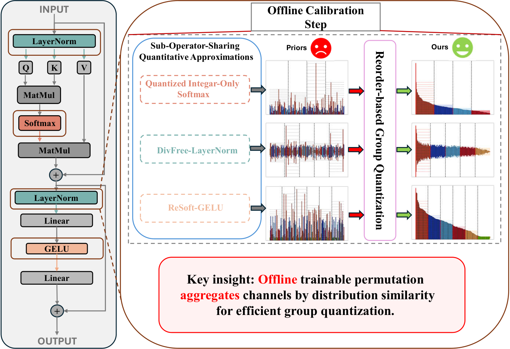
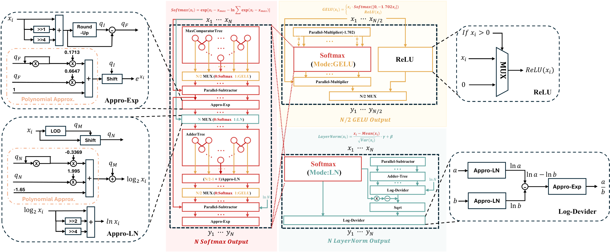
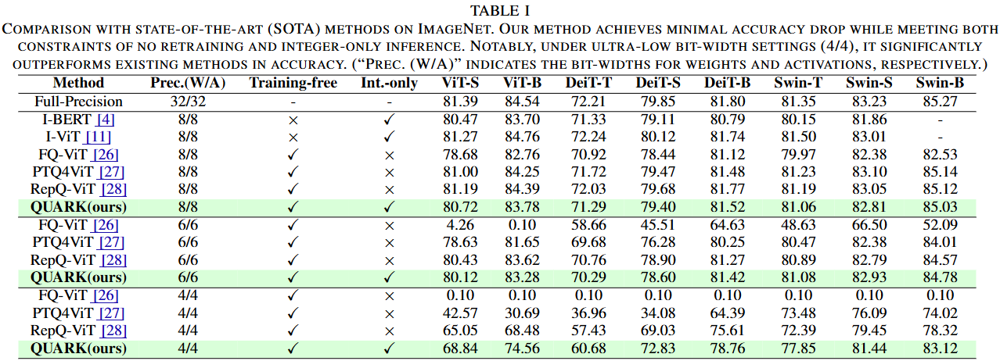
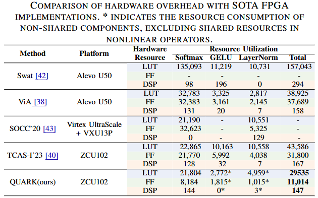

# [ICCAD'25] QUARK: Quantization-Enabled Circuit Sharing for Transformer Acceleration by Exploiting Common Patterns in Nonlinear Operations

Zhixiong Zhao*, Haomin Li*, Fangxin Liu, Yuncheng Lu, Zongwu Wang, Tao Yang, Li Jiang, and Haibing Guan

---

> **Abstract:** Transformer-based models have revolutionized computer vision (CV) and natural language processing (NLP) by achieving state-of-the-art performance across a range of benchmarks. However, nonlinear operations in models significantly contribute to inference latency, presenting unique challenges for efficient hardware acceleration. To this end, we propose QUARK, a quantization-enabled FPGA acceleration framework that leverages common patterns in nonlinear operations to enable efficient circuit sharing, thereby reducing hardware resource requirements. QUARK targets all nonlinear operations within Transformer-based models, achieving high-performance approximation through a novel circuit-sharing design tailored to accelerate these operations. Our evaluation demonstrates that QUARK significantly reduces the computational overhead of nonlinear operators in mainstream Transformer architectures, achieving up to a 1.96× end-to-end speedup over GPU implementations. Moreover, QUARK lowers the hardware overhead of nonlinear modules by more than 50% compared to prior approaches, all while maintaining high model accuracy---and even substantially boosting accuracy under ultra-low-bit quantization.





# <a name="results"></a>🔎 Results

<details>
<summary>Algorithm Accuracy Results (click to expand) </summary>
<li> Performance comparison of various methods on ImageNet (Table 1 from the main paper). 
 
<p align="center">
    
</p>

</details>

<details>
<summary>Hardware Evaluation (click to expand) </summary>
<li> Comparison of hardware overhead with SOTA FPGA implementations. \textbf{*} indicates the resource consumption of non-shared components, excluding shared resources in nonlinear operators. (Table 4 from the main paper). 
 
<p align="center">
    
</p>

</details>

## Citation

If you find the code helpful in your research or work, please cite the following paper.

```
@misc{zhao2025quarkquantizationenabledcircuitsharing,
      title={QUARK: Quantization-Enabled Circuit Sharing for Transformer Acceleration by Exploiting Common Patterns in Nonlinear Operations}, 
      author={Zhixiong Zhao and Haomin Li and Fangxin Liu and Yuncheng Lu and Zongwu Wang and Tao Yang and Li Jiang and Haibing Guan},
      year={2025},
      eprint={2511.06767},
      archivePrefix={arXiv},
      primaryClass={cs.LG},
      url={https://arxiv.org/abs/2511.06767}, 
}
```